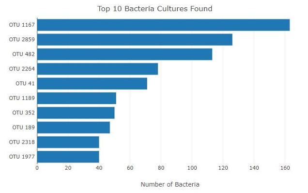
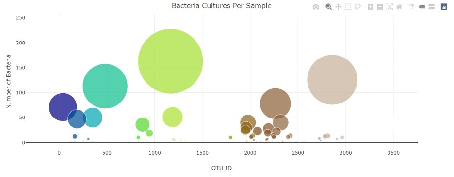
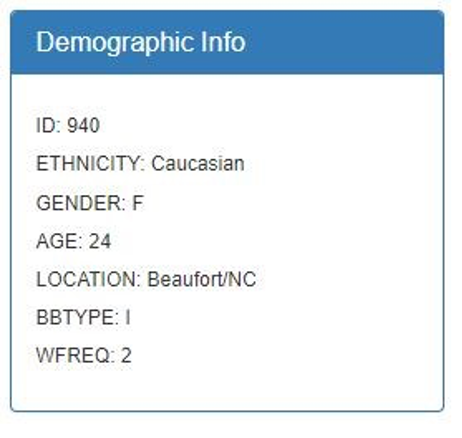
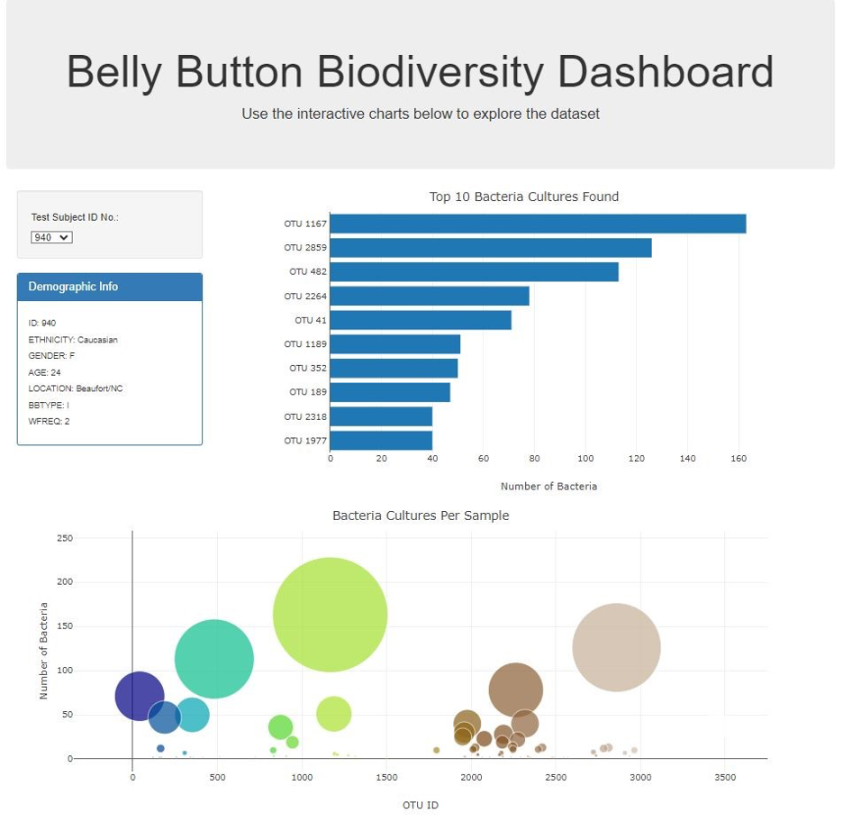

# belly-button-challenge

## Background
In this assignment, you will build an interactive dashboard to explore the Belly Button Biodiversity dataset, which catalogs the microbes that colonize human navels.   
The dataset reveals that a small handful of microbial species (also called operational taxonomic units, or OTUs, in the study) were present in more than 70% of people, while the rest were relatively rare. 
## Before You Begin
Create a new repository for this project called belly-button-challenge. Do not add this Challenge to an existing repository.  
Clone the new repository to your computer.  
Inside your local git repository, copy the files from in the StarterCode folder contained within the Module 14 Challenge zip file. i.e. index.html, samples.json, and the static folder. 

NOTE:You will not be required to access the samples.json file locally, but it is provided for reference. 

Push the above changes to GitHub.  
Deploy the new repository to GitHub Pages. 
## Files
Download the following files to help you get started:  
Module 14 Challenge files Links to an external site. 
## Instructions
Complete the following steps:  
Use the D3 library to read in samples.json from the URL https://static.bc-edx.com/data/dl-1-2/m14/lms/starter/samples.json.  
Create a horizontal bar chart with a dropdown menu to display the top 10 OTUs found in that individual.  
Use sample_values as the values for the bar chart.  
Use otu_ids as the labels for the bar chart.  
Use otu_labels as the hovertext for the chart. 

Create a bubble chart that displays each sample.  
Use otu_ids for the x values.  
Use sample_values for the y values.  
Use sample_values for the marker size.  
Use otu_ids for the marker colors. Use otu_labels for the text values. 

Display the sample's metadata, i.e., an individual's demographic information.  
Loop through each key-value pair from the metadata JSON object and create a text string.  
Append an html tag with that text to the #sample-metadata panel 

Update all the plots when a new sample is selected. Additionally, you are welcome to create any layout that you would like for your dashboard. An example dashboard is shown as follows:

Deploy your app to a free static page hosting service, such as GitHub Pages. Submit the links to your deployment and your GitHub repo. Ensure that your repository has regular commits and a thorough README.md file 
## Hints
Use console.log inside of your JavaScript code to see what your data looks like at each step. Refer to the Plotly.js documentation when building the plots. 
## Requirements
#### Bar Chart (30 points) 
Chart initializes without error (10 points)  
Chart updates when a new sample is selected (5 points)  
Chart uses Top 10 sample values as values (5 points)  
Chart uses otu_ids as the labels (5 points)  
Chart uses otu_labels as the tooltip (5 points) 
#### Bubble Charts (40 points) 
Chart initializes without error (10 points)  
Chart updates when a new sample is selected (5 points)  
Chart uses otu_ids for the x values (5 points)  
Chart uses otu_ids for marker colors (5 points)  
Chart uses sample_values for the y values (5 points)  
Chart uses sample_values for the marker size (5 points)  
Chart uses otu_labels for text values (5 points) 
#### Metadata and Deployment (30 points) 
Metadata initializes without error (10 points)  
Metadata updates when a new sample is selected (10 points)  
App Successfully Deployed to Github Pages (10 points) 
